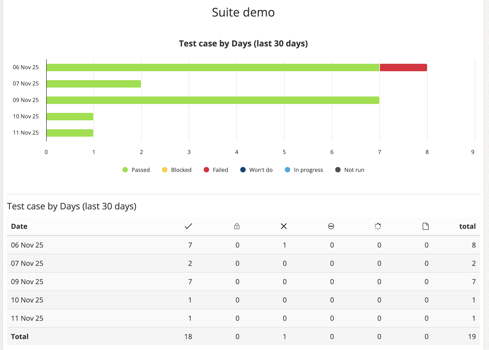

# Test Automation Project

This repository contains a demo project for test automation using `pytest` (`pytest-playwright`) library and [testuff](https://testuff.com/) platform. 

this project does the following:
- checks the availability of the main page of codeff.nl
- instors test results in testuff platform

Project also includes configuration for CI/CD using GitHub Actions.

Workflow runs on manual trigger.

## Prerequisites

- python 3.7+
- uv package manager
- testuff account

## Setup

1. Clone the repository:

   ```bash
   git clone https://github.com/gdev19/test-automation-project.git
    ```
   
2. Install dependencies:

   ```bash
   uv sync
   ```

3. Activate virtual environment:

   ```bash
   source .venv/bin/activate
   ```

4. Create `.env` file and store credentials for testuff  environment:

    ```.env
    USERNAME=<your_testuff_username>
    PASSWORD=<your_testuff_password>
    TOKEN=<your_testuff_api_token>
    HOME_PAGE_TEST1_ID=<your_testuff_test_case_id>
    ``` 

    You can find `HOME_PAGE_TEST1_ID` or any test ID by the following command:

    ```
    list(testuff_client.get(Test))
    ```

5. Install Playwright browsers:

   ```bash
   playwright install  
   ```

## Running Tests

1. Run tests:

   ```bash
   pytest
   ```

2. View test results in Testuff platform.
 
